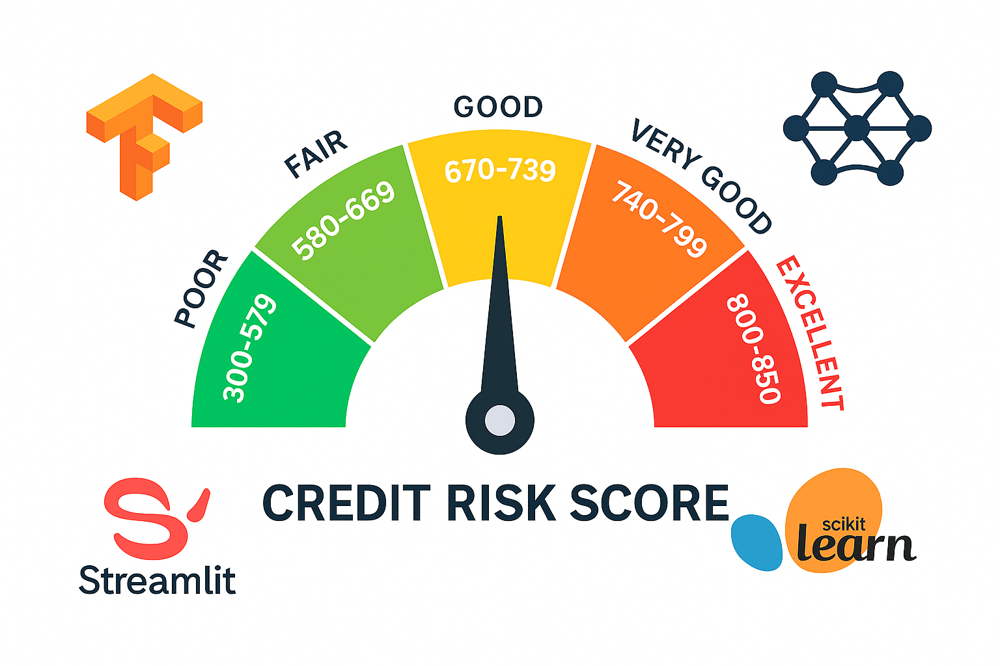
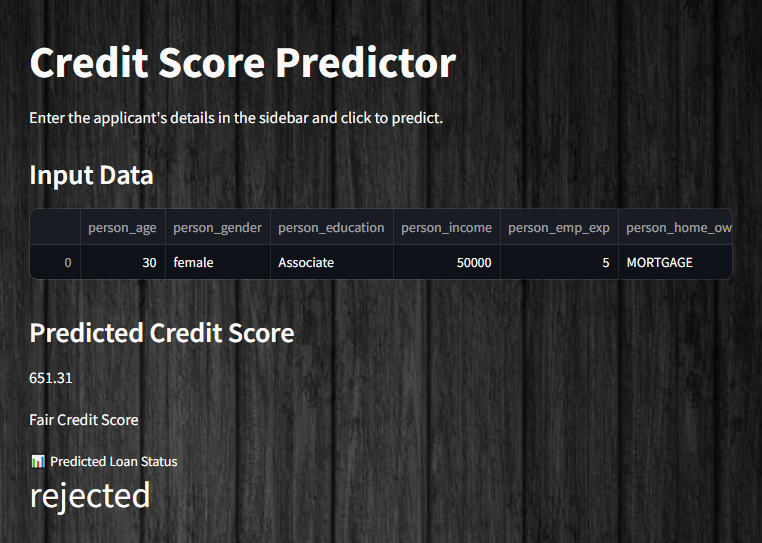

#  Loan Credit Score and Status Prediction Project with Tensorflow

## Table of Contents

1. [Project Overview](#project-overview)
2. [Features](#features)
3. [Dataset](#dataset)
4. [Preprocessing Pipeline](#preprocessing-pipeline)
5. [Model Architectures](#model-architectures)

   * [Credit Score Regression Model](#credit-score-regression-model)
   * [Loan Status Classification Model](#loan-status-classification-model)
6. [Training and Evaluation](#training-and-evaluation)
7. [Streamlit Application](#streamlit-application)
8. [Installation](#installation)
9. [Project Structure](#project-structure)
10. [Contributing](#contributing)

---

## Project Overview

This project provides an end-to-end solution for predicting credit scores and loan approval outcomes using machine learning models and a user-friendly Streamlit web application. It consists of:

* **Credit Score Regression Model**: Predicts an applicant’s credit score based on demographic and financial features.
* **Loan Status Classification Model**: Predicts whether a loan application will be approved or rejected, using both the original features and the predicted credit score.
* **Streamlit App**: An interactive interface allowing users to input applicant data and view model predictions in real time.

## Features

* data cleaning and outlier removal.
* Feature engineering: calculation of ratios such as loan-to-income and income-per-year-experience.
* Scalable preprocessing with `StandardScaler` for numeric features and `OneHotEncoder` for categorical features.
* Two separate Keras neural network architectures:

* A regression network for credit score prediction.
* A binary classification network for loan status.
* Threshold optimization for classification using Youden’s J statistic.
* User interface built with Streamlit, featuring an intuitive sidebar, real-time metrics, and charts.

## Dataset

* **Source**: `loan_data.csv`
* **Size**: \~10,000–50,000 records (customizable)
* **Features**:

  * Numeric: `person_age`, `person_income`, `person_emp_exp`, `loan_amnt`, `loan_int_rate`, `loan_percent_income`, `cb_person_cred_hist_length`, `credit_score`
  * Categorical: `person_gender`, `person_education`, `person_home_ownership`, `loan_intent`, `previous_loan_defaults_on_file`
* **Target Variables**:

  * `credit_score` (numeric regression target)
  * `loan_status` (binary classification target: `Yes`/`No`)

## Preprocessing Pipeline

Data preprocessing is implemented with scikit-learn's `ColumnTransformer`:

```python
from sklearn.compose import ColumnTransformer
from sklearn.preprocessing import StandardScaler, OneHotEncoder

preprocessor = ColumnTransformer([
    ('std', StandardScaler(), numeric_features),
    ('ohe', OneHotEncoder(handle_unknown='ignore', sparse=False), categorical_features)
])

X_train_proc = preprocessor.fit_transform(X_train)
X_test_proc = preprocessor.transform(X_test)
```

* **StandardScaler** normalizes numeric features to zero mean and unit variance.
* **OneHotEncoder** transforms categorical values into dummy/indicator variables.

## Model Architectures

### Credit Score Regression Model

* **Framework**: TensorFlow / Keras
* **Input shape**: `(n_features,)`
* **Layers**:

  1. Dense(256, activation='relu') + BatchNormalization
  2. Dense(128, activation='relu') + BatchNormalization + Dropout(0.15)
  3. Dense(64, activation='relu') + BatchNormalization + Dropout(0.15)
  4. Dense(32, activation='relu')
  5. Dense(1, activation='linear')

```python
model = Sequential([
    Input(shape=(X_train_proc.shape[1],)),
    Dense(256, activation='relu'),
    BatchNormalization(),
    Dense(128, activation='relu'),
    BatchNormalization(),
    Dropout(0.15),
    Dense(64, activation='relu'),
    BatchNormalization(),
    Dropout(0.15),
    Dense(32, activation='relu'),
    Dense(1, activation='linear')
])
```

### Loan Status Classification Model

* **Framework**: TensorFlow / Keras
* **Input shape**: `(n_features + 1,)` (includes `credit_score`)
* **Layers**:

  1. Dense(32, activation='relu')
  2. Dense(16, activation='relu')
  3. Dense(1, activation='sigmoid')

```python
model_2 = Sequential([
    Input(shape=(X_train_proc2.shape[1],)),
    Dense(32, activation='relu'),
    Dense(16, activation='relu'),
    Dense(1, activation='sigmoid')
])
```

## Training and Evaluation

Both models use the following training strategies:

* **Optimizer**: Adam (learning\_rate=1e-3) or alternative (SGD+momentum,etc.)
* **Loss**:

  * Regression: Mean Absolute Error (MAE)
  * Classification: Binary Crossentropy


Example training call:

```python
history = model.fit(
    X_train, y_train,
    epochs=100,
    batch_size=32,
)
```

Evaluate performance on test set:

```python
loss, mae = model.evaluate(X_test, y_test)
print(f"Test MAE: {mae:.2f}")  # for regression

loss, acc = model_2.evaluate(X_test, y_test2)
print(f"Test Accuracy: {acc:.2%}")  # for classification
```

## Streamlit Application


The `StreamlitApp.py` provides an interactive dashboard:

* **Sidebar Inputs**: Age, Gender, Education, Income, Employment Experience, Home Ownership, Loan Amount, Loan Intent, Interest Rate, Credit History Length, Previous Defaults.
* **Predictions**:

  1. **Credit Score**: displays a numeric prediction with color-coded metric.
  2. **Loan Status**: displays approval probability and class label.
  3. **Credit Score Category** (e.g., "Excellent", "Good", etc.) based on FICO ranges.
* **Usage**:

  ```bash
  streamlit run StreamlitApp.py
  ```

## Installation

1. Clone the repository:

git clone [https://github.com/your\_username/loan\_credit\_score\_tensorflow.git](https://github.com/your_username/loan_credit_score_tensorflow.git)

cd loan_credit_score_tensorflow

````
2. Create and activate a virtual environment:
   ```bash
python -m venv .venv
source .venv/bin/activate  # Linux/Mac
.\.venv\Scripts\activate   # Windows
````

3. Install dependencies:


pip install -r requirements.txt

````
4. Run the Streamlit app:
   ```bash
streamlit run StreamlitApp.py
````


## Project Structure

```
loan_credit_score_tensorflow/
├── .gitignore
├── README.md
├── StreamlitApp.py
├── loan_data.csv
├── requirements.txt
├── credit_score_model/      # saved regression model files
├── loan_status_model/       # saved classification model files
├── credit_score_model.ipynb # notebook for regression model experiments
└── loan_status_model.ipynb  # notebook for classification experiments
```

## Contributing

Forever Open-Source ! Feel free to open a GitHub issue or submit a pull request.

*Developed by Kubilay.*
